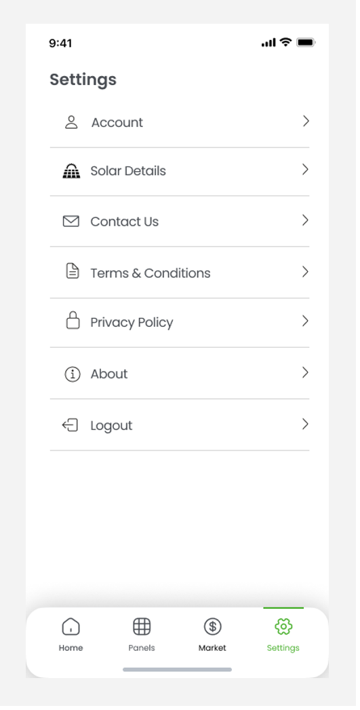

<h1 align="center">
    Solar Trade ☀️
</h1>

This project was developed as part of the Human Computer Interation (IPC) at FEUP with the goal of studying User-Centered Design and focusing on creating user-friendly interfaces.

## What is Solar Trade?
It is a mobile app prototype designed to help users manage and optimize their solar
panel systems. It allows users to monitor energy production and consumption in real-time,
perform auto-repairs through embedded robots, and sell excess energy to the grid, including
international markets.

## Wireflows

<figure align="center">
    
    <figcaption>Figure 1: Overview and Detailed Solar Power Usage</figcaption>
</figure>
 

<figure align="center">
    
    <figcaption>Figure 2: Detailed Energy Consumption</figcaption>
</figure>
 

<figure align="center">
    
    <figcaption>Figure 3: Manage My Panels</figcaption>
</figure>
 

<figure align="center">
    
    <figcaption>Figure 4: Solar Panel Details</figcaption>
</figure>
 

<figure align="center">
    
    <figcaption>Figure 5: Repair Tutorial</figcaption>
</figure>
 

<figure align="center">
    
    <figcaption>Figure 6: Start Auto-Repair</figcaption>
</figure>
 

<figure align="center">
    
    <figcaption>Figure 7: Schedule a Repair</figcaption>
</figure>
 

<figure align="center">
    
    <figcaption>Figure 8: Navigate the Trade Market</figcaption>
</figure>
 

<figure align="center">
    
    <figcaption>Figure 9: Market Details</figcaption>
</figure>
 

<figure align="center">
    
    <figcaption>Figure 10: Donate Energy</figcaption>
</figure>
 

<figure align="center">
    
    <figcaption>Figure 11: Sell Energy</figcaption>
</figure>
 

<figure align="center">
    
    <figcaption>Figure 12: Buy Energy</figcaption>
</figure>
 

<figure align="center">
    
    <figcaption>Figure 13: Settings</figcaption>
</figure>
 

<figure align="center">
    
    <figcaption>Figure 14: Guiding Screens and Pop-ups</figcaption>
</figure>
 

